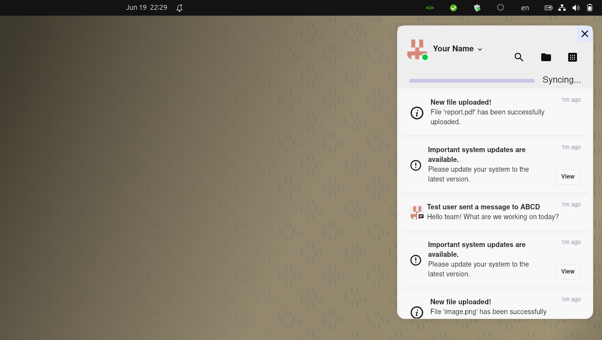

Dependencies:
```
	sudo apt-get install fuse3 libfuse3-dev libxdo-dev
	rustup
```
# ncRS Desktop client



## Feature Goals:
| Feature                   | Nextcloud Desktop | GNOME Integration/GVfs | ncRS |
| :------------------------ | :---------------- | :--------------------- | :--- |
| Nextcloud Notifications         | ✅ | ❌ | ✅ |
| Full Shell integration    | ✅                | N/A since it's only online                    | ✅   |
| Instant local access      | ✅                | ❌                     | ✅   |
| Virtual Files             | ❌ (Experimental, bad approach which doesn't work with shell/file pickers etc)                | ✅ (remote only)                     | ✅   |
| Dynamically cache files/keep part locally | ❌                | ❌ (Limited caching, generally on-demand access) | ✅   |
| HPB Support/Speed         | ❓ (Not explicitly stated, generally good sync performance) | ❌ | ✅ |


### TODO (minimal):
+ [x] base tauri tray icons https://github.com/tauri-apps/tray-icon
+ [x] HTML tauri settings ui with tray icon support
	+ [x] open window only when clicking about
	+ [x] load js file, interactable (back!)
	+ [x] show icon and window separately
	+ [x] tokio setup function
	+ [x] window interactions:
		+ [x] disable close, maximize
		+ [x] hide window on close. FIX: minimize event not firing
	+ [x] app icon: gnome only loads icons from .desktop files in which case tauri dev won't be able to display the icon
	+ [x] multiple icons
	+ [x] clone all NC Desktop app options
	+ [x] save state machine
	+ [x] multiple icons given sync machine
	+ [x] pause & edit state menu
	+ [-] open in top position: cannot get this to work in Gnome

+ [x] import fuse mount
+ [x] fix tokio error
+ [x] basic fuse mount

+ [x] send notifications multi-platform
+ [x] yaml config reader `yaml-rust2 = "0.9.0"`. Overridable with
+ [-] play notification sound: requires rodio in separate thread https://github.com/RustAudio/rodio/blob/f1eaaa4a6346933fc8a58d5fd1ace170946b3a94/examples/music_ogg.rs

+ [ ] Webdav implementation
+ [ ] Auto-suffix webdav://example.com/nextcloud/remote.php/dav/files/USERNAME/

+ [ ] Actual tauri menu UI:
	+ [ ] get avatar: https://github.com/nextcloud/desktop/blob/cd44540a5a30c1e639edc8082228d211a3d9a34b/src/libsync/networkjobs.cpp#L787C1-L787C148
		yourcloud.domain/remote.php/dav/avatars/userID/256.png
	+ [ ] View user login info/status: HPB Connection, DAV Connection. Turn orange if HPB NOK.
	+ [ ] Access mounted folder
	+ [ ] main Settings:
		+ [ ] ignored files regex (filter from list, filter from sync) -> keep only in cache
		-- cache
		+ [ ] cache options: max size, algorithm: FIFO/LIFO
		+ [ ] option to pre-fetch folders up to certain size or not
	+ [ ] other config:
		+ [ ] play notification sound
		+ [ ] show sync notifications
		+ [ ] ?
	+ [ ] Setup flow:
		+ config exists? -> load: ok|err ->
		+ ask for login flow in browser: https://github.com/traxys/nextcloud-passwords-client
		+ save as yaml, lock yaml file permissions
	+ [ ] Set status! Online/offline etc
	----
	WEB API:
	+ [ ] fetch notifications
	+ [ ] edit configuration/save yaml
	+ [ ] open local folder

+ [ ] network error handling: EAGAIN|ETIMEDOUT https://pubs.opengroup.org/onlinepubs/009695399/functions/read.html
+ [ ] Systemd service

### Functionality
+ [x] Tray icon
+ [ ] VFS File handling https://github.com/nextcloud/desktop/issues/3668
> FUSE is not a good solution when network is involved because the normal file API you end up using to access FUSE filesystems is not able to cope with network errors. (?)
> https://github.com/nextcloud/desktop/issues/3668#issuecomment-905330846
+ [ ] VFS Webdav mount
	+ [ ] Proper VFS with files openable through terminal

+ [ ] Nextcloud notifications API
+ [ ] nautilus-nextcloud icon support
	+ [ ] simple, modular RPC api for multiple file browsers: fetch 'recency' of files given path or dir
	+ [ ] Basic PY implementation https://linuxconfig.org/how-to-write-nautilus-extensions-with-nautilus-python
	https://gnome.pages.gitlab.gnome.org/nautilus-python/nautilus-python-migrating-to-4.html
	see: https://github.com/nextcloud/desktop/blob/master/shell_integration/nautilus/syncstate.py

+ [ ] Implement files HPB push API (native Nextcloud Desktop API). Would be faster than rclone NC/WebDav [source](https://www.reddit.com/r/NextCloud/comments/ueby94/rclone_as_desktop_sync_client_replacement/)
	+ [ ] support multiple backends: webdav, HPB...
	HPB appears to use csync https://docs.nextcloud.com/desktop/3.4/architecture.html
	'csync (this project) is a client-only file synchronizer for users using existing protocols like smb or sftp'
	-> probably smart to use remotefs-webdav and remotefs-rs, for the inbuilt SFTP support

	+ [ ] HPB here: https://github.com/nextcloud/notify_push/
	It runs a websockets server on cloud.your.domain/push/ws
	There's an existing test client in rust! https://github.com/nextcloud/notify_push/blob/main/test_client/src/main.rs

+ Can we implement webdav and HPB? -> yes it does seem like it!

+ [ ] mass deployment / cli setup ensure working. Warn only apppassword https://docs.nextcloud.com/desktop/3.9/advancedusage.html#mass-deployment-and-account-creation

+ [ ] local cache implementation:
> + fetch file request: get etag/modification date. Do this first by folder (test!)
> + if etag changed, fetch to nc-raw
> + ln -s from fuse to /mount/nc-raw/
> + save etags in DB 
> + save file structure in db. React file structure using notify_sync (fast traversal)
> + query db to perform cache logic and prune next file request asynchronously (prioritize latency!)

	with tokio_uring! https://gist.github.com/munro/14219f9a671484a8fe820eb35d26bb80
	+ https://github.com/foyer-rs/foyer
	+ https://docs.rs/freqfs/0.4.3/freqfs/
	+ https://github.com/pedrocr/syncer
	+ https://forum.autonomi.community/t/syncer-a-caching-fuse-based-filesystem-in-rust/32018
	+ https://github.com/kahing/catfs
	TDD this!
Choose DB:
https://github.com/cberner/redb
https://github.com/rusqlite/rusqlite
Turso Limbo

+ [ ] E2E Encryption
+ [ ] ignored files regex (filter from list, filter from sync) -> keep only in cache
> This vs GVfs
+ Webdav is super slow (~5/10s delay)
+ Potential for local cache

### Known bugs
+ [ ] fix `fusermount3: option allow_other only allowed if 'user_allow_other' is set in /etc/fuse.conf` without setting it


## Future
+ [ ] Clean branding images/icons etc. Ask NC team
+ [ ] Add project to remotefs-rs/remotefs-rs list of used projects
