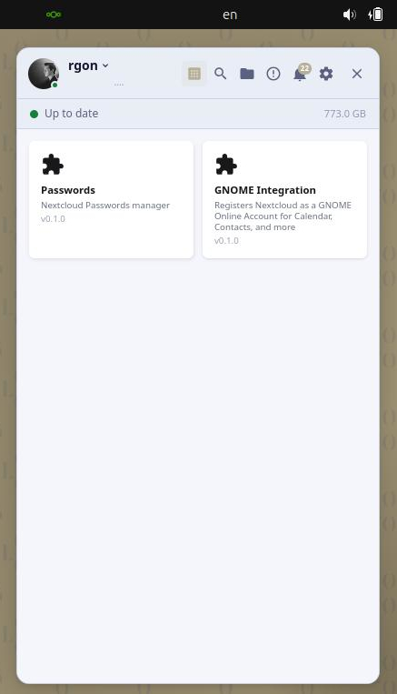
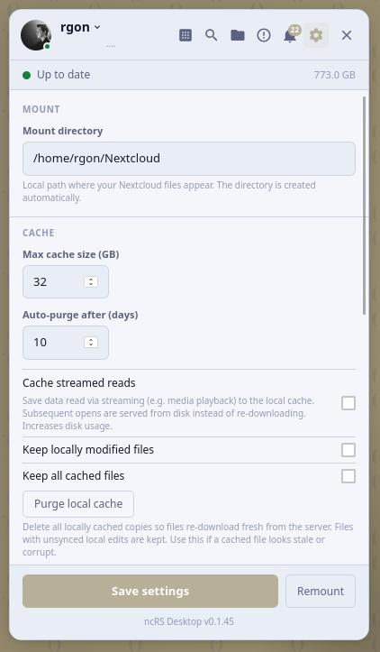
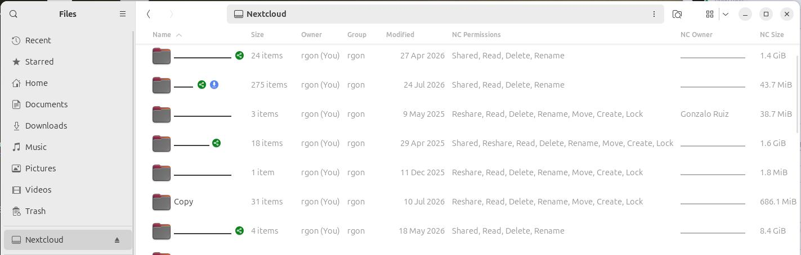
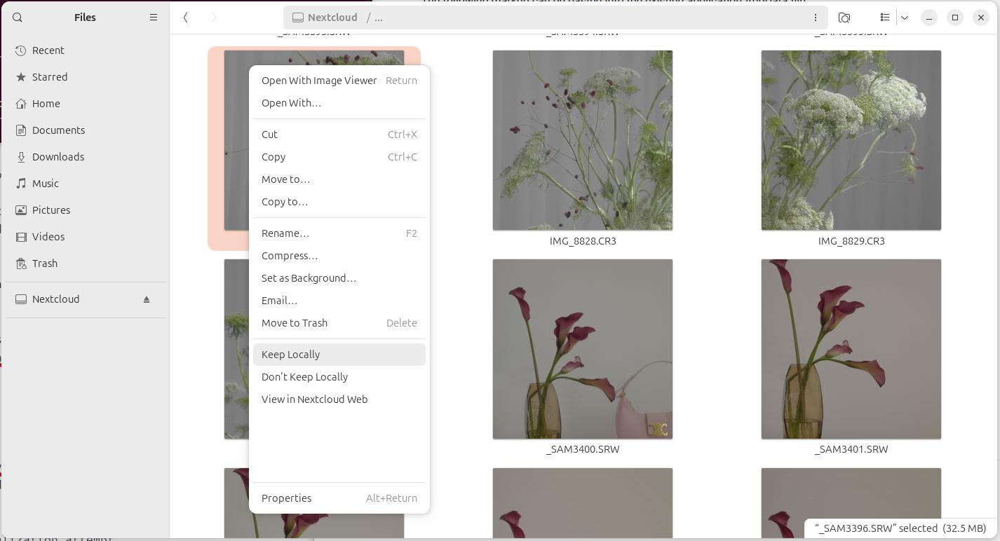

# ncRS Desktop client
Unofficial Nextcloud Desktop client with proper VFS support on *nix. Rewritten from scratch in rust.
Designed to perform well in installations with a very large amount of shared files/media etc (where cloud storage >> local storage), as well as in a smaller cloud.

| | |
|---|---|
|  |  |
|  |  |
> NOTE: personal info has been edited out from the screenshots, in real life it looks normal :)

## Feature comparison:
| Feature                   | Nextcloud Desktop | GNOME Integration/GVfs | ncRS |
| :------------------------ | :---------------- | :--------------------- | :--- |
| Real Virtual Filesystem             | ❌ (Experimental, bad approach which doesn't work with shell/file pickers etc)                | ✅ (remote only)                     | ✅   |
| Streaming Download Support (play large 4K videos at network-rate)         | ❌ | ❌ (yes, but throughput is lower) | ✅ |
| Nextcloud Notifications         | ✅ | ❌ | ✅ |
| Nautilus integration: syncing/downloaded/shared    | ✅ (partial)                | N/A since it's only online                    | ✅   |
| Instant local access      | ✅                | ❌                     | ✅   |
| Fast time to first use (usable right after setup, no bulk download first) | ❌ (must fully download the entire selected folder tree before anything is usable) | ✅ | ✅ |
| Zero-copy cache reads (kernel serves the cached file directly, no extra copy through the app) | ✅ (not really a fair comparison — it isn't virtual, so *every* file is a permanent full local copy, always "cached" by definition) | ❌ | ✅ (Linux 6.9+, via kernel FUSE passthrough) |
| Nextcloud-generated thumbnails         | ❌ | ❌ | ✅ (even for RAW images!) |
| Local cached file pruning      | ❌                | ❌                     | ✅ intelligently keeps local copies of often-used files  |
| Dynamically cache files/keep part locally | ❌                | ❌ (No internet = no files) | ✅   |
| No path conflicts | ❌ (may emit sync errors)               | ✅ | ✅ No dumb 'Some files could not be synced' |
| Maps nextcloud permissions to filesystem permissions      | ❌                | ❌ (will error, but doesn't first display it to the user)                    | ✅   |
| HPB Support/Sync speed         | ✅ NC HPB | ❌ | ✅ NC HPB |
| QUIC/HTTP3 Support         | ❌ | ❌ | ✅ |
| Syncing multiple OS paths -> different folders within Nextcloud     | ✅ | ❌ | ❌ (everything mounted under the Nextcloud path) |


## Server tips
Server-side recommendation: If you have shell access to your Nextcloud server, you shall enable background thumbnail pre-generation with occ preview:pre-generate. 

This makes the server generate thumbnails during idle time rather than on-demand, which would eliminate the congestion entirely for directories that have been indexed.

We avoid local thumbnail generation so that entire files don't have to be downloaded for the local thumbnailer to run.

## Usage
Download and install the .deb file from the [/releases](https://github.com/rgon/ncrsDesktop/releases) page. You may simply double click the `.deb` to install it with your OS's package manager.

### First-time setup
You may directly set it up using the GUI, following the interactive 'Authorize Device'-type login from the web browser. This issues a revocable Nextcloud app password, which is saved in your OS keyring (GNOME Keyring/KWallet).

The recommended configuration options are the defaults. However, you may modify them via the cogwheel icon in the application menu.

## Non-interactive setup
`ncrs-gui` writes its configuration to a yaml file, for easy view and editing.

You may edit this file to configure it non-interactively, which is especially useful for remote/fleet deployment.

**Create the config file** — run the daemon once to generate the skeleton, then fill it in:
```sh
cargo run -p ncrs_core        # exits immediately, writes ~/.config/ncrs/config.yaml
nano ~/.config/ncrs/config.yaml
```

The file looks like this. You shall use an [app password](https://docs.nextcloud.com/server/latest/user_manual/en/session_management.html#managing-devices) rather than the user's main password:
```yaml
url: https://cloud.example.com/remote.php/dav/files/YOUR_USERNAME/
username: youruser
password: xxxx-xxxx-xxxx-xxxx   # app password (optional) or fetched/saved from the system keyring
mount_point: /home/you/ncrs
user: youruser
```

### Provisioning (corporate / multi-user)

The `.deb` (built by `scripts/build-deb.sh` will allow fleet config. For 

- **Config is per-user** at `~/.config/ncrs/config.yaml` (XDG; there is no system-wide config). A template ships at `/usr/share/doc/ncrs/config.yaml.example`, or generate one with `ncrs --print-default-config`.
- **Push per-user config files** with your config-management tool (e.g. Ansible `template` to each user's `~/.config/ncrs/config.yaml`). You may pre-fill `/etc/skel/.config/ncrs/config.yaml` so new accounts start provisioned. If setting the password on the config file, always use per-user [app passwords](https://docs.nextcloud.com/server/latest/user_manual/en/session_management.html#managing-devices) or an `auth_command` — never a shared credential.
- **The GUI tray app autostarts at login** via `/etc/xdg/autostart/ncrs-gui.desktop` and runs the systemctl service. 
- **Headless alternative**: `systemctl --user enable --now ncrs.service` runs the daemon without the GUI. The two coexist: when the GUI starts and finds the service already serving the IPC socket, it attaches as a client — mirroring sync state, errors, and transfers in the tray and forwarding pause/resume — instead of mounting a second time. Quitting an attached tray will unmount it, however.


## Advanced usage
Download the .deb and manually install it
```
cd Downloads
sudo apt install ./ncrs_*_amd64.deb
```
And open it from your applications list or the terminal `ncrs-gui & disown`

### Dependencies (shall be automatically requested by the .deb)
```sh
sudo apt-get install fuse3 libfuse3-dev libxdo-dev
```

### Development dependencies
The Rust toolchain: https://rustup.rs/

For the Nautilus extension (optional):
```sh
sudo apt-get install python3-nautilus
```

### Development running

**GUI + daemon** (the normal way):
```sh
./runui.sh
```
This starts the Tauri tray app; the daemon mounts WebDAV at your configured `mount_point` automatically. 

It will also install the shell integrations etc: `./shell_integration/nautilus/install.sh` to show sync-state emblems (cloud = remote-only, tick = local) on files in the mount.

Downloaded files are cached in `~/.cache/ncrs/`.

**Daemon only** (headless / for systemd):
```sh
RUST_LOG=info cargo run -p ncrs_core
```

#### Uninstall extension:
```sh
rm ~/.local/share/nautilus-python/extensions/syncstate.py
nautilus -q
```

### Running tests

Unit + integration tests (no server needed — integration tests skip gracefully):
```sh
cargo test
python3 -m unittest shell_integration.nautilus.test_syncstate -v
```

End-to-end tests against a real WebDAV server (requires Docker):
```sh
docker compose -f docker/docker-compose.yml up -d
WEBDAV_TEST_URL=http://localhost:8888 cargo test -p ncrs_core --test integration_test
docker compose -f docker/docker-compose.yml down
```

Package build + verification (what CI runs; `--container` needs Docker or Podman):
```sh
./scripts/build-deb.sh              # options: --version, --arch, --out-dir, --skip-gui, --skip-build
./scripts/test-deb.sh --container   # metadata, contents, desktop entries, clean-install smoke test
```

## Cache and Storage Paths

ncrs stores locally-available files under `~/.cache/ncrs/<server-hash>/`:

| Directory | Purpose | Survives restart | User-controlled |
|-----------|---------|-----------------|-----------------|
| `kept/`   | Files explicitly pinned via "Keep Locally" | Yes | Yes (KEEP/EVICT) |
| `cache/`  | Files auto-downloaded during reads | Yes (validated on boot) | No (may be evicted) |

The `<server-hash>` component is derived from the WebDAV URL to allow multiple server configurations.

Additional metadata files in the root:
- `dir_cache.json` -- cached directory listings (etags + entries)
- `file_cache.json` -- tracks which files are cached/kept locally (remote path, etag, kept flag)
- `journal.bin` -- offline mutation journal for pending uploads/deletes/renames

Config options (in `~/.config/ncrs/config.yaml`):
- `auto_keep_locally_modified_files: true` -- keep a local copy after uploading a file you edited
- `auto_keep_cached_files: true` -- promote read-cached files to kept automatically
- `cache_max_size_bytes: 34359738368` -- max size for `cache/` directory (default 32 GB, 0 = unlimited). Oldest-accessed files are evicted first.
- `cache_auto_purge_days: 10` -- auto-delete cached files not accessed in N days (default 10, 0 = disabled)
- `cache_streamed_reads: true` -- promote fully-streamed files to disk cache
- `read_ahead_bytes: 67108864` -- read-ahead window for streaming reads (default 64 MB)
- `cache_cleanup_interval_secs: 3600` -- how often to run cache pruning (default 3600 = 1 hour)
- `dir_cache_max_stale_mins: 15` -- before showing a directory whose cached listing is older than this, ask the server whether it changed, so the first listing is already current (default 15, 0 = disabled). An unchanged directory costs one small etag request. Only applies while push notifications are down; while they work, a 24-hour backstop applies.
- `keep_paths: ["/Documents", "/Photos"]` -- remote paths to auto-keep locally on startup (default empty)
