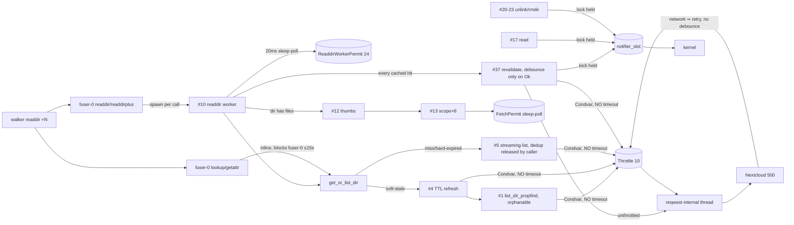
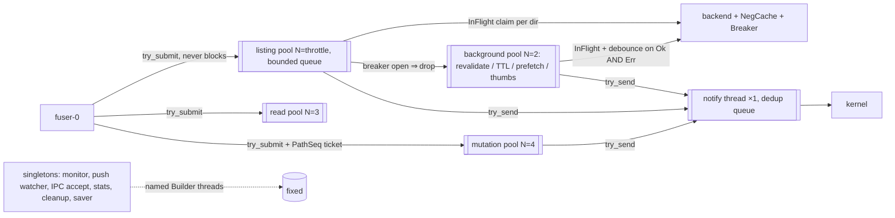

# Plan: thread leak, 5xx handling, tree-walker resilience (2026-09-24)

Incident: installed ncrs 0.1.76 (pid 1166451) ran 15h42m, reached **10,160 threads**
(9,800 `fuser-0`), ~950 MB RSS, 52% CPU, load avg ~900. It was killed at 10:46 CEST.
The snapshot is in the session scratchpad (`cpu_incident/`), and the forensics are in `forensics/`.

## 1. What happened (evidence-based)

| Layer | Finding | Evidence |
|---|---|---|
| Trigger | **Claude Code subagents ran `find / -name …`** without `-xdev`. The Bash tool timed out at 120 s and moved them to the background, where they walked all of `~/Nextcloud` for 20 min to 2 h. This happened in 5/5 walk windows, and the run with no `find` had no walk. | forensics table: run A 11:40 (20,539 dirs, 21.5k PROPFIND in 21 min, peak ~20/s); B1/B2 remu `find / -name protoc`; D1/D2 accounting_schema `find / -name davclient.py … \| head -5` at 10:21:13 |
| Server | Nextcloud answers bursts of **500** (5–7 with the same timestamp), which points to overload from ~10 concurrent Depth-1 PROPFINDs with 12 props (inferred) | journal bursts |
| Client error model | A 500 becomes a `String`, then `BackendReadError::Network`, then "network:". It is treated like a dropped TCP connection: retried ×3 **while holding a throttle slot**, never negatively cached, never debounced. A 5xx on `/` in the connectivity probe flips the mount offline. | `propfind.rs:67`, `nextcloud.rs:131-139`, `lib.rs:617`, `lib.rs:998-1029`, `nextcloud.rs:374-404` |
| Errno bug | The errno is chosen by substring-matching the error message, which contains the path. A dir named `2404` that 500s returns ENOENT, and `…401…`/`…403…` returns EACCES. | `nextcloud.rs:131`, `lib.rs:980-996`, `lib.rs:4300` |
| Thread leak | All ~45 spawn sites are detached `thread::spawn`, and permits are taken **after** spawning. Under 5xx, the per-dir guards are never set, or are released by the wrong party. Threads then park on `Throttle::acquire()` (Condvar, **no timeout**) or 20 ms sleep-poll permits. | see §3 |

The ranked leak suspects are all reached from readdir on `fuser-0`:
1. `revalidate_dir_on_read` (`notify_push.rs:523`) spawns on every cached readdir. Its debounce is written only on success (`:624`), and `refreshing` is checked but never set. Its etag probe is **unthrottled** (`:557`), and it then does `throttle.acquire()` with no timeout (`:576`).
2. Streaming list (`lib.rs:2185`). The caller gives up after 15 s and removes `pending_dirs` (`lib.rs:2266`) while the worker is still queued, so the next readdir spawns a duplicate.
3. Soft-TTL refresh (`lib.rs:2061`) plus `list_dir_propfind` (`lib.rs:1006`). The inner thread is orphaned by `recv_timeout(47s)`, and `clear_refreshing` then allows another pair.
4. One readdir worker per call, including continuation pages (`lib.rs:3885`). `ReaddirWorkerPermit` is a 20 ms sleep-poll with no timeout (`lib.rs:3369`). This matches the ~0.5% CPU per `fuser-0` thread in the snapshot, i.e. runnable load.
5. Thumbnail prefetch (`lib.rs:4283`) has no global thread cap. `FetchPermit` sleep-polls (`preview.rs:59`).

There is also a latent hazard: every `inval_inode`/`delete` runs while holding the global `notifier_slot` mutex (`notify_push.rs:611`, `lib.rs:5153`, `6104`, `6167`, `6316`). One kernel-blocked notify would freeze all the others (the same class as the 2026-09-21 deadlock).

Unknown: how the 9,800 split across suspects 1–4, because the journal is WARN-only and has 118 lines. Phase 1 settles this.

## 2. Goals / invariants to guarantee

- **G1 Bounded threads.** The total thread count is ≤ a compile-time-known constant: `FUSE(1) + singletons(~10) + Σ pool sizes + IPC(≤64)`, independent of request rate, server behaviour, or walker.
- **G2 No unbounded waits in background work.** Every wait has a deadline or is cancellable, and no permit is held across a sleep.
- **G3 One in-flight fetch per (dir, purpose).** An RAII claim is released only by the owner of the work.
- **G4 A 5xx is a server answer.** It is never offline, never retried in the foreground, is negatively cached per path with backoff, is served stale when possible, and has a global breaker that sheds *background* work.
- **G5 A walker can't monopolise the backend.** Requesters are identified and rate-limited per pid for uncached listings.
- **G6 Deadlocks are impossible by construction.** Notifier calls go through one dedicated thread and are never made while holding a lock.

## 3. Thread-creation graph (current → target)

Current (from the audit; `#n` = site in the audit table):

Target:

A full queue gets a defined answer and never spawns: foreground replies EAGAIN, or serves stale if a listing is cached; background work is dropped and counted.

## 4. Phases

### Phase 0 — Stop the trigger (today, no code)
- [ ] Add a **Claude Code PreToolUse hook** (via the `update-config` skill, in user settings). It denies any Bash `find`, `du`, `rg`, `grep -r`, `fd` or `ls -R` rooted at `/`, `~` or `/home/rgon` unless the command has `-xdev`, or prunes/excludes `Nextcloud` (for `rg`: `--one-file-system`). It also denies Glob/Grep tool calls with path `/` or `/home/rgon`. The reason message tells the agent to use `-xdev`.
- [ ] Also add a line to the user CLAUDE.md: "never recurse from / or ~ without -xdev; ~/Nextcloud is a network FUSE mount." The hook is the actual guarantee; the CLAUDE.md line is a hint.
- [ ] Decide whether to restart ncrs now. Until Phase 2 ships, a new `find /` would reproduce the leak, but the hook prevents the known trigger.
- [ ] Side items: `~/.config/ncrs/config.yaml` is 0664 and should be `chmod 0600`; `/.trackerignore` is missing from the persisted root listing (investigate separately).

### Phase 1 — Reproduce + regression harness (Docker e2e, `verify` skill; never the live mount)
- [ ] Add a **fault-injecting proxy** in front of the Nextcloud test container, e.g. a small Python/mitm or nginx `return 500` for a percentage of PROPFINDs, deterministic per path and in bursts. The config should allow `5xx_rate`, `5xx_paths`, and `latency`.
- [ ] Add a **tree fixture**: about 20k dirs, depth up to 18, including `.git`-like trees, dir names with `401`/`2404`, and control-char filenames.
- [ ] Add a **walker driver**: `find /mnt -name nothing` plus a parallel second find, run for N minutes.
- [ ] Add **probes**: sample `/proc/<ncrs>/status` Threads, a `/proc/<ncrs>/task/*/{comm,wchan}` histogram, `/proc/<ncrs>/stat` CPU, and a count of PROPFINDs seen at the proxy.
- [ ] First run it against **0.1.76 unchanged** to record a baseline and attribute the leak using the wchan histogram (`futex_wait` = suspects 1–3, `hrtimer_nanosleep` = sleep-pollers 4–5). Save the numbers in the PR description.
- [ ] Turn it into a **CI regression test** with pass criteria:
  - Threads ≤ `MAX_THREADS` (G1 constant + 5) at every sample.
  - Idle CPU after the walker stops is < 2% within 30 s.
  - PROPFINDs per unique dir is ≤ 1.2 while the breaker is closed.
  - Zero 5xx retries on the foreground path.
  - Mount never goes offline.
  - The same dir 500-ing repeatedly produces ≤ log2(window/5s) requests.

### Phase 2 — Thread model with enforced bounds (the leak fix)
New module `ncrs_core/src/bg.rs`. **This must be the only place that can create threads.**

- **`Pool`**: `Pool::new(name, workers, queue_cap)` spawns `workers` threads named `ncrs-<name>-<i>` using `thread::Builder`, fed by `std::sync::mpsc::sync_channel(queue_cap)`.
  - `#[must_use] fn try_submit(&self, job) -> Result<(), Full<Job>>` is non-blocking, so it is safe on fuser-0.
  - Workers wrap each job in `catch_unwind` so a panic never shrinks the pool.
  - `JoinHandle`s are stored and joined on shutdown (drop the sender, then join).
  - This is what makes G1 a construction-time fact: threads are created only in `Pool::new`, and pools are created only in `mount_ncfs`.
- **`InFlight<K>`**: `try_claim(k) -> Option<Claim>`. `Claim: Drop` removes the key, and the claim moves *into* the job, so only the worker releases it (fixes suspect 2). Waiters join via a `Shared` result slot (Condvar with `wait_timeout`). A waiter timing out never touches the claim.
- **`Throttle`**: make `acquire()` private or delete it, and keep only `acquire_timeout(d) -> Option<Permit>`. Replace `ReaddirWorkerPermit` and `FetchPermit` sleep-polls with this Condvar semaphore (removes the 20 ms busy-pollers). The permit is a guard, so holding it across a retry sleep is a visible bug. Release it before sleeping.
- **Singletons** (monitor, push watcher, IPC accept, state monitor, stats, cleanup, dir-cache saver, journal replay) go through `bg::spawn_singleton(name, f)`. It is guarded by an `AtomicBool` per name with `ReleaseOnDrop` (the existing pattern at `lib.rs:7101`), so a second start is refused.
- **Enforcement:**
  - Add `clippy.toml` with `disallowed-methods = ["std::thread::spawn", "std::thread::Builder::spawn", "std::thread::Builder::spawn_scoped"]`, plus `#[allow(clippy::disallowed_methods)]` only inside `bg.rs`. `thread::scope` stays allowed, since it is joined by construction. The existing `#6/#13/#45` scope users are fine; bound their fan-out (chunk sizes) with a `const`.
  - Add `-D clippy::disallowed_methods` to CI clippy.
  - Add a unit test that spawns `MAX_THREADS` worth of pools and asserts `/proc/self/status` Threads, plus a debug-build `assert!` in `Pool::new` that Σ workers ≤ budget.
- **Migrate the sites** (audit table numbers):
  - Readdir `#10` becomes a `listing` job that carries `ReplyDirectory`. On `Full`, it serves stale if cached, else `EAGAIN`.
  - `#4`, `#5`, `#1`, `#7` go to `listing` or `background` with `InFlight` keyed `(dir, Purpose)`. `list_dir_propfind` stops spawning a second thread; timeouts come from the request itself.
  - `#37`/`#38` revalidate go to `background` with `InFlight`. **The debounce is recorded on Ok *and* Err** (Err uses exponential cooldown), and the etag probe takes a permit.
  - `#12`/`#13` thumbnails go to the `background`/`thumb` pool with a global cap. The `active_streams` wait gets a deadline.
  - `#14`/`#15`/`#16` read waiters go to the `read` pool, size = `read_throttle`, with a dedicated queue so foreground reads never wait behind listings.
  - `#8`, `#9`, `#19`, `#22`, `#24`, `#25` mutations go to the `mutation` pool, keeping `PathSeq` ordering. Give `Ticket::wait` a production `wait_timeout` that logs and fails the op loudly rather than parking.
  - `#11`, `#18` are fire-and-forget deletes and go to `background`.
  - `#32` boot per-file validation becomes `thread::scope` over fixed chunks.
  - IPC `#43`/`#44` callbacks go to `background`.
- **Notifier (G6):** a single `ncrs-notify` thread fed by `sync_channel(1024)` with dedup (a `HashSet` of pending inode/entry ops). Callers `try_send`, and on `Full` coalesce into "invalidate parent". No caller holds `notifier_slot` across a kernel call anymore. This preserves the 2026-09-21 rule structurally rather than by convention.
- **Take lookup/getattr re-lists off fuser-0** (`lib.rs:3839, 4349, 4448, 5586`). Join an existing `InFlight` result with `acquire_timeout`, or answer from the cache or with EAGAIN. fuser-0 must never block on the network.

**Static guarantee + complexity coverage**
- `docs/threads.md` holds the §3 target graph and a table that CI checks against: a small `xtask`/script that greps for `Pool::new`/`spawn_singleton` and fails if a site isn't listed.
- Enable `clippy::cognitive_complexity` (threshold 25) on `bg.rs` and the job bodies. Keep each job body small by splitting fetch / apply / notify into separate fns.
- Test every exit path of every primitive:
  - Pool: submit ok, `Full`, job panic → worker survives, shutdown joins all.
  - InFlight: claim, duplicate refused, drop releases, waiter timeout leaves the claim intact, claim moved into a job released on job panic.
  - Throttle: timeout returns `None`, permit drop wakes a waiter.
  - Notify queue: dedup, `Full` → coalesce.
- Each migrated job: Ok / 5xx / transport / timeout / truncated body paths, each asserting that the claim is released and the debounce is recorded. Use `cargo llvm-cov` on `bg.rs` + job fns and require 100% branch coverage for `bg.rs`.
- Why not async/tokio: that would be a bigger rewrite, and the fixed pools give the same bound with std primitives. Revisit later.

### Phase 3 — Error semantics (G4)
- [ ] **Typed errors end to end.** `propfind.rs` returns `PropfindError { Status(u16), Transport(kind), Timeout, BodyTruncated, Parse }`. `nextcloud.rs` maps it to `BackendReadError::{NotFound, Client(u16), Server(u16), Transport, Timeout, Truncated}`. Delete `str_to_read_error`'s substring matching, and delete the substring matching in `error_to_errno` and at `lib.rs:4300`: errno comes from the variant. Add a unit test covering dir names `2404`, `401x`, `timeout`.
- [ ] **Offline only on transport failure.** In `check_reachability`, 5xx/429 becomes `Degraded(code)`, not `Unreachable`. Mirror `BackendWriteError::is_network_down`. Keep `is_unreachable_listing_error` true for 5xx, for the stale-fallback only.
- [ ] **Retry policy.**
  - Foreground 5xx: 0 retries.
  - Background 5xx/truncated: at most 1 retry with jittered backoff.
  - Transport: the existing behaviour.
  - Never hold a permit while sleeping.
- [ ] **Per-path negative cache** `NegCache<PathBuf> {code, until, failures}`. Initial TTL 5 s, ×2 per failure up to 5 min, ±20% jitter, modelled on `preview.rs:81-105`. A hit serves stale if any listing exists, else returns EIO immediately with no request. Background work skips negatively cached paths. Clear the entry on a notify-push change for that path.
- [ ] **Global 5xx breaker.** A sliding window: >20 5xx in 30 s, or ≥50% of ≥10 requests, opens the breaker for 30–120 s with jitter. While open:
  - pause background work (revalidate, TTL refresh, prefetch, validate_subtree, thumbnails) and drop it at submit;
  - lower foreground concurrency to 3;
  - **do not** set offline;
  - go half-open with one probe.
  - Report state over IPC so the GUI shows "Server is returning errors — slowing down".
- [ ] **Serve stale on 5xx** whenever any listing exists, including invalidated or TTL-stale ones. `validate_subtree` must not `dir_cache.remove` a listing before its replacement arrives (`lib.rs:6775-6795`). Lookup/getattr on a 5xx parent return EIO/EAGAIN, not ENOENT.
- [ ] **Truncated body.** Split the header timeout (15 s) from a body *idle* timeout (e.g. 15 s without bytes), not a total deadline. That fixes the `/Music` "response body error". Don't pin a partial streaming snapshot as a complete listing without a guaranteed follow-up invalidation.
- [ ] **Lighter PROPFIND** (optional, measure first). Drop `oc:owner-display-name` and `oc:share-types` from the Depth-1 body, or fetch them lazily for the overlay, to cut server cost per listing.
- [ ] **Logging.** Aggregate per (path, class): WARN at most once per backoff window per path, plus a 60 s summary ("PROPFIND 5xx: 37 dirs, 112 responses, breaker open 45 s"). "incremental list" goes to debug. `push_error` sends one aggregated GUI entry, not one per dir.

### Phase 4 — Walker identification and politeness (G5)
- [ ] **Record the requester.** In readdir/readdirplus/lookup/opendir, capture `req.pid()`. Resolve it through a small LRU of pid → (comm, cmdline head, parent chain up to 3, e.g. `find ← bash ← claude`) from `/proc`.
- [ ] **Per-requester counters.** Uncached listings per pid per minute. Log `WALKER pid=… comm=find chain=find←bash←claude rate=…/min` at WARN when a pid exceeds 60 uncached dirs/min, and expose it via IPC `STATS` and a GUI notification ("`find` (from claude) is crawling your Nextcloud — 1,000 folders/min").
- [ ] **Per-pid token bucket** for *uncached* listings, e.g. burst 50, refill 10/s, configurable. Over budget, the request queues in `listing` at low priority. Cached answers are never limited. Optionally, when a walker is detected, skip `revalidate_dir_on_read` for that pid's reads, since a crawler doesn't need freshness.
- [ ] **Decide the interleaving question** from the forensics: does serving partial streaming snapshots for uncached dirs let a single `find` fan out ~10 wide? If yes, that is by design for UX but should count toward the pid's bucket.

### Phase 5 — Rollout
PRs in this order, each small and verified with the Phase 1 harness through the `verify` skill:
1. `test(e2e): 5xx fault-injection proxy + tree-walk thread-bound regression` (baseline 0.1.76 numbers, expected to fail)
2. `fix(core): classify PROPFIND status codes; 5xx is not offline or retried in the foreground` (Phase 3 typed errors, errno bug, probe, permit-across-sleep)
3. `fix(core): single-flight + failure debounce for revalidate/refresh/streaming list` (the direct leak fix for suspects 1–3, in place, before the big refactor)
4. `refactor(core): bounded named worker pools; ban std::thread::spawn outside bg` (Phase 2)
5. `fix(fuse): route kernel notifications through a single notify thread`
6. `feat(core): per-path negative cache and 5xx circuit breaker`
7. `feat(core): identify and rate-limit tree walkers per pid`

Constraints (from memory):
- Single-line conventional commits.
- Never test on the live `~/Nextcloud` or launch a built binary while the installed one is live.
- Check `df /` before builds and remove Docker images and `target/debug/incremental` after.
- Release through release-please as usual.

## 5. Open questions
- Attribution of the 9,800 threads across suspects (Phase 1 baseline).
- Are the server 500s pure overload or deterministic, e.g. in dirs containing control-character filenames? Check the Nextcloud server log (`nextcloud.log`) for the incident timestamps.
- `/.trackerignore` missing from the persisted root listing.
